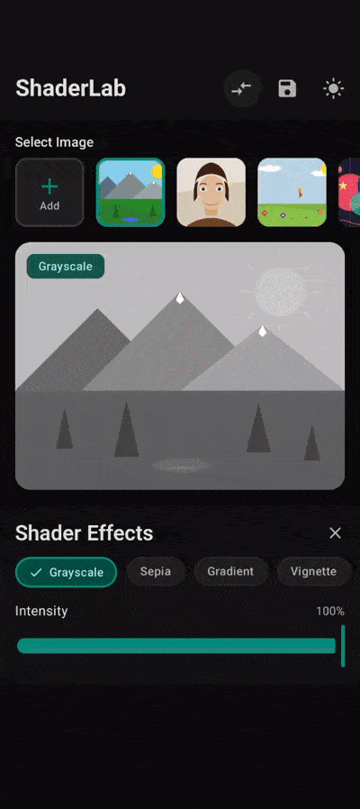
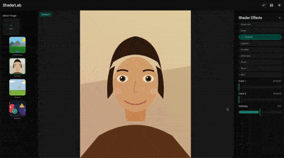
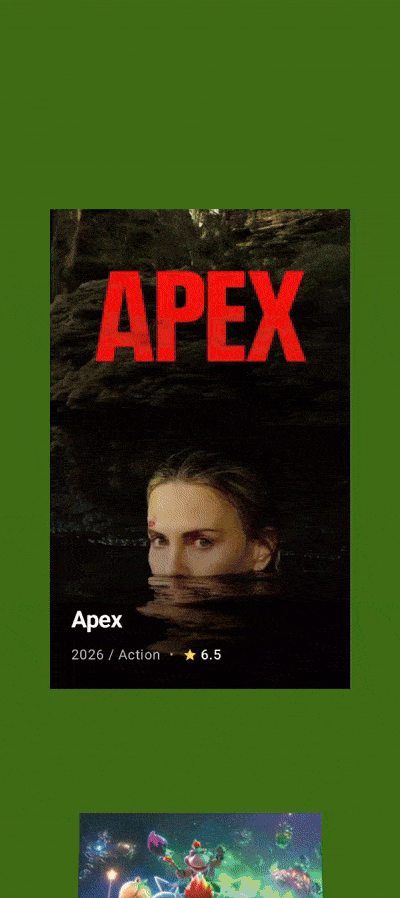

<div align="center">

# ShaderX

**GPU shader effects for Compose Multiplatform — one API, every platform.**

[](https://central.sonatype.com/artifact/io.github.debanshu777/shaderx)
[](https://kotlinlang.org)
[](https://www.jetbrains.com/lp/compose-multiplatform/)
[](LICENSE)
[](https://android-arsenal.com/api?level=33)

<br/>

|                                                ShaderLab — Android                                                 |                                          ShaderLab — Web                                           |
|:------------------------------------------------------------------------------------------------------------------:|:--------------------------------------------------------------------------------------------------:|
|  |  |
|                                     Effect gallery with live parameter sliders                                     |                                 Same codebase, compiled to Wasm/JS                                 |

|                                      ASCIICamera — Real-time Camera Filter                                      |                                   Vertical Carousel — Scroll-driven Effects                                    |
|:---------------------------------------------------------------------------------------------------------------:|:--------------------------------------------------------------------------------------------------------------:|
|  |  |
|                                     Shader on live CameraX frames at 60 fps                                     |                                    Per-card effects driven by scroll state                                     |

</div>

---

## Why ShaderX?

Most UI toolkits treat shader effects as an afterthought — platform-specific, hard to parameterize,
impossible to compose. ShaderX is designed from the ground up for **Compose Multiplatform** and
solves three real problems:

| Problem                        | What most teams do                                          | What ShaderX does                                                                |
|--------------------------------|-------------------------------------------------------------|----------------------------------------------------------------------------------|
| **Cross-platform GPU effects** | Write AGSL for Android, separate Desktop path, no iOS story | Single Kotlin API — platform backends are an implementation detail               |
| **Effect reuse & composition** | Hard-code effects per screen; cannot combine them           | `GrayscaleEffect() + VignetteEffect()` chains effects with a single `+` operator |
| **Offline image processing**   | Separate pipeline, no shader reuse                          | `ImageProcessor` shares the factory's compiled-shader cache                      |

---

## Platform Support

| Platform          | Shader Backend         | Min Version                 | Composite Effects |
|-------------------|------------------------|-----------------------------|-------------------|
| **Android**       | AGSL (`RuntimeShader`) | API 33                      | Full (API 31+)    |
| **iOS**           | Skia `RuntimeEffect`   | iOS 14+ (arm64 / Simulator) | Last effect only  |
| **Desktop (JVM)** | Skia `RuntimeEffect`   | JDK 21                      | Last effect only  |
| **Web (Wasm/JS)** | Skia `RuntimeEffect`   | Modern browsers             | Last effect only  |

> Full composite chaining across all platforms is on the roadmap.

---

## Installation

```kotlin
// settings.gradle.kts
dependencyResolutionManagement {
    repositories {
        mavenCentral()
    }
}

// build.gradle.kts (shared module)
dependencies {
    implementation("io.github.debanshu777:shaderx:0.1.2")
}
```

**Requirements:** JDK 21 · Kotlin 2.3+ · Compose Multiplatform 1.10+

---

## Quick Start

**One line to apply an effect:**

```kotlin
Image(
    painter = painterResource("photo.png"),
    contentDescription = null,
    modifier = Modifier.shaderEffect(GrayscaleEffect())
)
```

**Animated effects — handled automatically:**

```kotlin
@Composable
fun AnimatedWave() {
    // rememberShaderEffect drives the animation loop via withFrameMillis.
    // The effect identity is stable across frames — no unnecessary recomposition.
    val wave = rememberShaderEffect(WaveEffect(amplitude = 15f, frequency = 6f))

    Image(
        painter = painterResource("photo.png"),
        contentDescription = null,
        modifier = Modifier.shaderEffect(wave)
    )
}
```

**Chain effects with `+`:**

```kotlin
// Grayscale → Vignette → Blur, applied in order
val effect = GrayscaleEffect() + VignetteEffect(radius = 0.6f) + NativeBlurEffect(radius = 3f)

Image(modifier = Modifier.shaderEffect(effect))
```

**Offline image processing:**

```kotlin
val factory = ShaderFactory.create()
val processor = ImageProcessor.create(factory)

val result = processor.process(imageBytes, SepiaEffect(intensity = 0.8f))
result
    .onSuccess { processedBytes -> saveToFile(processedBytes) }
    .onFailure { error -> log("Processing failed: ${error.message}") }

factory.close()
```

---

## Built-in Effects

Nine production-ready effects ship out of the box, each with validated parameter ranges and a stable
`@Immutable` data class representation.

### GrayscaleEffect

Converts to grayscale using the standard luminance formula: `0.299R + 0.587G + 0.114B`.

```kotlin
GrayscaleEffect(intensity = 1f)     // full grayscale
GrayscaleEffect(intensity = 0.5f)   // half-blended with original
```

| Parameter   | Type    | Range     | Default | Description                          |
|-------------|---------|-----------|---------|--------------------------------------|
| `intensity` | `Float` | 0.0 – 1.0 | `1.0`   | Blend between original and grayscale |

---

### SepiaEffect

Vintage photograph look using the standard sepia transformation matrix.

```kotlin
SepiaEffect(intensity = 1f)
```

| Parameter   | Type    | Range     | Default | Description                      |
|-------------|---------|-----------|---------|----------------------------------|
| `intensity` | `Float` | 0.0 – 1.0 | `1.0`   | Blend between original and sepia |

---

### VignetteEffect

Darkens image edges with a smooth center-to-edge gradient — ideal for focus effects and cinematic
framing.

```kotlin
VignetteEffect(radius = 0.5f, intensity = 0.5f)
```

| Parameter   | Type    | Range     | Default | Description                                 |
|-------------|---------|-----------|---------|---------------------------------------------|
| `radius`    | `Float` | 0.0 – 1.0 | `0.5`   | Distance from center where darkening begins |
| `intensity` | `Float` | 0.0 – 1.0 | `0.5`   | Strength of the edge darkening              |

---

### NativeBlurEffect

Hardware-accelerated Gaussian blur. Uses `RenderEffect.createBlurEffect()` on Android and Skia's
`ImageFilter.makeBlur()` on iOS/Desktop — the fastest path on every platform.

```kotlin
NativeBlurEffect(radius = 10f)
```

| Parameter | Type    | Range         | Default | Description           |
|-----------|---------|---------------|---------|-----------------------|
| `radius`  | `Float` | 0.0 – 50.0 px | `10.0`  | Blur radius in pixels |

---

### PixelateEffect

Retro mosaic by snapping fragment coordinates to a pixel grid.

```kotlin
PixelateEffect(pixelSize = 10f)
```

| Parameter   | Type    | Range          | Default | Description                                |
|-------------|---------|----------------|---------|--------------------------------------------|
| `pixelSize` | `Float` | 1.0 – 100.0 px | `10.0`  | Block size in pixels (auto-clamped to ≥ 1) |

---

### ChromaticAberrationEffect

Simulates lens color separation by offsetting the red and blue channels radially from the image
center.

```kotlin
ChromaticAberrationEffect(offset = 5f)
```

| Parameter | Type    | Range         | Default | Description                   |
|-----------|---------|---------------|---------|-------------------------------|
| `offset`  | `Float` | 0.0 – 20.0 px | `5.0`   | Channel displacement distance |

---

### InvertEffect

Inverts all color channels (`1.0 - value`), alpha preserved. No configuration needed.

```kotlin
InvertEffect()
// or use the singleton:
InvertEffect.Default
```

---

### WaveEffect *(Animated)*

Sinusoidal distortion driven by an internal clock. The `time` field is excluded from `equals`/
`hashCode` so the animation loop's `LaunchedEffect` never restarts mid-animation when you change
other parameters.

```kotlin
WaveEffect(amplitude = 10f, frequency = 5f, animate = true)
```

| Parameter   | Type      | Range         | Default | Description                  |
|-------------|-----------|---------------|---------|------------------------------|
| `amplitude` | `Float`   | 0.0 – 50.0 px | `10.0`  | Max pixel displacement       |
| `frequency` | `Float`   | 1.0 – 20.0    | `5.0`   | Wave cycles across the image |
| `animate`   | `Boolean` | —             | `true`  | Toggle animation on/off      |

---

### GradientEffect

Two-color gradient overlay blended over the original image. Supports both `Long` ARGB and Compose
`Color` APIs.

```kotlin
GradientEffect(
    color1 = 0xFFF3A397,   // coral (bottom-left)
    color2 = 0xFFF8EE94,   // light yellow (top-right)
    intensity = 0.5f
)

// Compose Color convenience API:
effect.withColor1(Color.Blue).withColor2(Color.Magenta)
```

| Parameter   | Type          | Range     | Default      | Description                        |
|-------------|---------------|-----------|--------------|------------------------------------|
| `color1`    | `Long` (ARGB) | —         | `0xFFF3A397` | Gradient start color (bottom-left) |
| `color2`    | `Long` (ARGB) | —         | `0xFFF8EE94` | Gradient end color (top-right)     |
| `intensity` | `Float`       | 0.0 – 1.0 | `0.5`        | Blend strength                     |

---

## Advanced Usage

### Dynamic Parameter Updates

All effects are immutable data classes. Updating a parameter returns a new instance — safe for
Compose state:

```kotlin
var effect by remember { mutableStateOf(GrayscaleEffect()) }

Slider(
    value = effect.intensity,
    onValueChange = { effect = effect.copy(intensity = it) }
)

// Or via the generic Float API (useful for generic parameter editors):
effect = effect.withParameter(GrayscaleEffect.PARAM_INTENSITY, 0.75f)

// Or fully typed (works for color and boolean parameters too):
effect = effect.withTypedParameter(
    GradientEffect.PARAM_COLOR_1,
    ParameterValue.ColorValue(0xFFFF5733)
)
```

### Effect Composition

Chain any number of effects with the `+` operator. On Android (API 31+), every effect in the chain
is applied in order. On other platforms, the last effect is applied.

```kotlin
// Operator syntax
val film = SepiaEffect() + VignetteEffect(radius = 0.6f)

// Named factory — identical result
val editorial = CompositeEffect.of(
    GrayscaleEffect(),
    ChromaticAberrationEffect(offset = 8f),
    VignetteEffect(intensity = 0.7f),
)

// Parameters in composites are namespaced with a U+001F delimiter.
// Two effects that both have "intensity" never collide:
val combined = GrayscaleEffect() + SepiaEffect()
val grayscaleIntensity = combined.getParameterValue("0\u001Fintensity")
val sepiaIntensity = combined.getParameterValue("1\u001Fintensity")
```

### Animation

`rememberShaderEffect` detects `AnimatedShaderEffect` implementations and drives a `withFrameMillis`
loop automatically. You provide the effect definition; the library handles timing.

```kotlin
@Composable
fun LiveWave(amplitude: Float, frequency: Float) {
    // Changing amplitude/frequency restarts the effect cleanly.
    // The time field is excluded from equals, so mid-animation parameter
    // changes don't reset the clock.
    val wave = rememberShaderEffect(
        WaveEffect(amplitude = amplitude, frequency = frequency)
    )

    Box(modifier = Modifier.fillMaxSize().shaderEffect(wave))
}
```

### Scoped Shader Factory

By default, `Modifier.shaderEffect` uses a process-wide `LocalShaderFactory` singleton. For
fine-grained cache control, provide a scoped factory:

```kotlin
@Composable
fun ShaderGallery() {
    // Factory is scoped to this composable's lifecycle.
    // maxCacheSize controls GPU memory trade-off.
    val factory = rememberShaderFactory(maxCacheSize = 16)

    CompositionLocalProvider(LocalShaderFactory provides factory) {
        LazyColumn {
            items(effects) { effect ->
                Image(modifier = Modifier.shaderEffect(effect))
            }
        }
    }
}
```

### Offline Image Processing

`ImageProcessor` shares the factory's compiled-shader cache — processing 1000 images with
`GrayscaleEffect` compiles the shader **once**.

```kotlin
val factory = ShaderFactory.create(maxCacheSize = 8)
val processor = ImageProcessor.create(factory)

suspend fun batchProcess(images: List<ByteArray>): List<ByteArray> {
    val effect = SepiaEffect(intensity = 0.9f)
    return images.mapNotNull { bytes ->
        processor.process(bytes, effect).getOrNull()
    }
}
```

### First-Frame Optimization

By default, the effect is applied one frame after layout (the composable must be measured before
shader dimensions are known). For known-size contexts, skip the delay entirely:

```kotlin
Image(
    modifier = Modifier.shaderEffect(
        effect = GrayscaleEffect(),
        knownSize = IntSize(imageWidth, imageHeight)
    )
)
```

---

## Custom Effects

Extend `AbstractRuntimeShaderEffect` for new AGSL/SkSL effects. The base class handles parameter
dispatch, range validation, and `withTypedParameter` automatically — you write the shader and
declare parameter handlers.

```kotlin
@Immutable
data class ThermalEffect(
    val intensity: Float = 1f,
    val heatColor: Long = 0xFFFF4500,  // orange-red
) : AbstractRuntimeShaderEffect() {

    override val id = "thermal_vision"
    override val displayName = "Thermal"

    override val shaderSource = """
        uniform shader content;
        uniform float2 resolution;
        uniform float intensity;
        layout(color) uniform half4 heatColor;

        half4 main(float2 fragCoord) {
            half4 color = content.eval(fragCoord);
            float luminance = dot(color.rgb, half3(0.299, 0.587, 0.114));
            half4 thermal = mix(color, heatColor * luminance, intensity);
            return half4(thermal.rgb, color.a);
        }
    """.trimIndent()

    override val parameterHandlers = mapOf(
        "intensity" to floatHandler<ThermalEffect>(
            spec = PercentageParameter("intensity", "Intensity", defaultValue = 1f),
            read = { it.intensity },
            write = { e, v -> e.copy(intensity = v) },
        ),
        "heatColor" to colorHandler<ThermalEffect>(
            spec = ColorParameter("heatColor", "Heat Color", defaultColor = 0xFFFF4500),
            read = { it.heatColor },
            write = { e, v -> e.copy(heatColor = v) },
        ),
    )

    override fun buildUniforms(width: Float, height: Float) = listOf(
        FloatUniform("resolution", width, height),
        FloatUniform("intensity", intensity),
        ColorUniform("heatColor", heatColor),
    )
}
```

**Shader contract:** Declare `uniform shader content;` and `half4 main(float2 fragCoord)`. The same
source compiles as AGSL on Android and SkSL on all other platforms.

For platform-native effects (e.g., blur via system APIs), extend `AbstractNativeEffect` and add a
branch to both `AndroidShaderFactory.createNativeEffect` and `SkiaShaderFactory.createNativeEffect`.

---

## Error Handling

All factory and processor operations return `ShaderResult<T>` — a functional result type with
composable combinators, no exceptions by default:

```kotlin
factory.createRenderEffect(effect, width, height)
    .onSuccess { renderEffect ->
        graphicsLayer { this.renderEffect = renderEffect }
    }
    .onFailure { error ->
        when (error) {
            is ShaderError.CompilationError ->
                log("Shader compile failed: ${error.message}")
            is ShaderError.UnsupportedEffect ->
                log("Not supported on this platform: ${error.effectId}")
            is ShaderError.PlatformNotSupported ->
                log("Platform limitation: ${error.message}")
            is ShaderError.ProcessingError ->
                log("Image processing error", error.cause)
            is ShaderError.Unknown ->
                log("Unexpected error", error.cause)
        }
    }

// Functional combinators — chain without nesting
val thumbnail = processor.process(bytes, effect)
    .map { processedBytes -> decodeThumbnail(processedBytes) }
    .recover { _ -> Bitmap.createBitmap(1, 1, ARGB_8888) }
    .getOrNull()

// Full combinator set:
// map, flatMap, fold, recover, onSuccess, onFailure, getOrNull, getOrElse, getOrThrow
```

---

## Architecture

### Source-Set Layout

```
shaderx/
└── src/
    ├── commonMain/      ← Effect definitions, Compose Modifier, ShaderResult, ImageProcessor
    ├── androidMain/     ← AGSL backend (RuntimeShader + LRU cache, thread-safe)
    └── skiaMain/        ← Shared Skia backend for iOS + Desktop + Web
        ├── iosMain      (depends on skiaMain)
        ├── jvmMain      (depends on skiaMain)
        └── wasmJsMain   (depends on skiaMain)
```

Non-Android platforms share one Skia implementation in `skiaMain`. New effects added there are
immediately available on iOS, Desktop, and Web.

### Type Hierarchy

```
ShaderEffect (sealed interface, @Stable)
├── RuntimeShaderEffect         — AGSL/SkSL shader source + buildUniforms()
│   └── AbstractRuntimeShaderEffect  — parameterHandlers, range validation
│       ├── GrayscaleEffect
│       ├── SepiaEffect
│       ├── VignetteEffect
│       ├── PixelateEffect
│       ├── ChromaticAberrationEffect
│       ├── InvertEffect
│       ├── WaveEffect          (also AnimatedShaderEffect)
│       └── GradientEffect
├── NativeEffect                — delegates to platform-native APIs
│   └── NativeBlurEffect        (BlurEffect)
├── AnimatedShaderEffect        — adds withTime(); driven by rememberShaderEffect
└── CompositeEffect             — ordered effect list, + operator, namespaced params
```

### Caching Strategy

Shader **compilation** is expensive (GPU driver round-trip). Uniform **updates** are cheap. ShaderX
keeps them separate:

- An access-order **LRU cache** holds compiled shader programs keyed by effect ID.
- **Android** (`AndroidShaderFactory`): fully synchronized — safe for concurrent access.
- **Skia** (`SkiaShaderFactory`): single-threaded per Compose window; Skia `Managed` objects are
  closed on eviction.
- Default cache size: 20 slots. Tune with `ShaderFactory.create(maxCacheSize = N)`.

### ParameterSpec System

Parameters are declared as sealed `ParameterSpec` subtypes with built-in validation:

| Spec type             | Value type    | Constraint                                                                               |
|-----------------------|---------------|------------------------------------------------------------------------------------------|
| `PercentageParameter` | `Float`       | Clamped to `0.0..1.0`                                                                    |
| `FloatParameter`      | `Float`       | Clamped to custom `range`                                                                |
| `PixelParameter`      | `Float`       | Clamped to `range`, displayed with `px`                                                  |
| `ToggleParameter`     | `Boolean`     | No numeric range (`hasRange = false`)                                                    |
| `ColorParameter`      | `Long` (ARGB) | No range; `defaultValue` returns `0f` (deprecated in favour of `getTypedDefaultValue()`) |

`CompositeEffect` namespaces child parameters with a U+001F (ASCII Unit Separator) delimiter —
non-printable and guaranteed absent from normal effect IDs.

---

## Sample Applications


### ShaderLab — [samples/ShaderLab](samples/ShaderLab)

Full-featured gallery app on **Android, iOS, and Desktop**. Browse all nine built-in effects, tweak
parameters with live sliders and color pickers, and apply composite stacks. Built entirely with the
public ShaderX API.

```bash
# Android
./gradlew :samples:ShaderLab:androidApp:installDebug

# Desktop
./gradlew :samples:ShaderLab:composeApp:run

# iOS (then open iosApp.xcodeproj in Xcode)
./gradlew :samples:ShaderLab:composeApp:linkDebugFrameworkIosSimulatorArm64
```

<br clear="right"/>


### ASCIICamera — [samples/ASCIICamera](samples/ASCIICamera)

**Real-time camera filter** on Android. Applies shader effects to live CameraX frames at 60 fps
using `ImageProcessor`. Demonstrates the offline processing API in a latency-sensitive streaming
context.

```bash
./gradlew :samples:ASCIICamera:androidApp:installDebug
```

<br clear="right"/>


### VerticalCarousel — [samples/VerticalCarousel](samples/VerticalCarousel)

Scroll-driven effect demo. Each card in a vertical pager applies a different shader, showing how to
bind effect parameters to scroll state and animate transitions between items.

<br clear="right"/>

---

## Roadmap

| Feature                                                        | Status  |
|----------------------------------------------------------------|---------|
| Full composite chaining on iOS / Desktop / Web                 | Planned |
| More built-in effects (noise, halftone, bloom, edge detection) | Planned |
| Shader hot-reload in debug builds                              | Planned |
| Declarative parameter animation DSL                            | Planned |
| WebGPU backend (Wasm)                                          | Planned |
| Video frame processing via `VideoProcessor`                    | Planned |

---

## Build Commands

```bash
# Build library (all platforms)
./gradlew :shaderx:build

# Run all checks and tests
./gradlew :shaderx:check

# JVM unit tests only
./gradlew :shaderx:jvmTest

# Publish to local Maven for integration testing
./gradlew :shaderx:publishToMavenLocal
```

---

## Technology Stack

| Category            | Technology            | Version |
|---------------------|-----------------------|---------|
| Language            | Kotlin                | 2.3.21  |
| UI Framework        | Compose Multiplatform | 1.10.3  |
| Build System        | Gradle / AGP          | 9.1.1   |
| Android compile SDK | —                     | 37      |
| Android min SDK     | —                     | 33      |
| Coroutines          | kotlinx-coroutines    | 1.10.2  |
| Serialization       | kotlinx-serialization | 1.11.0  |

